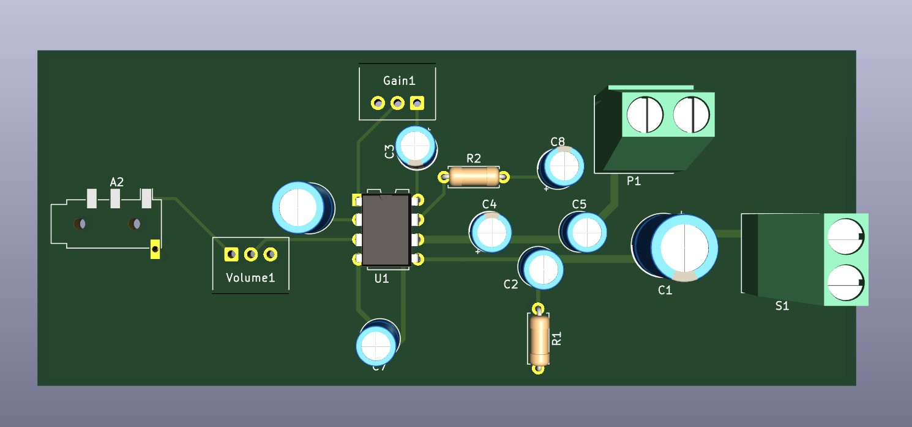
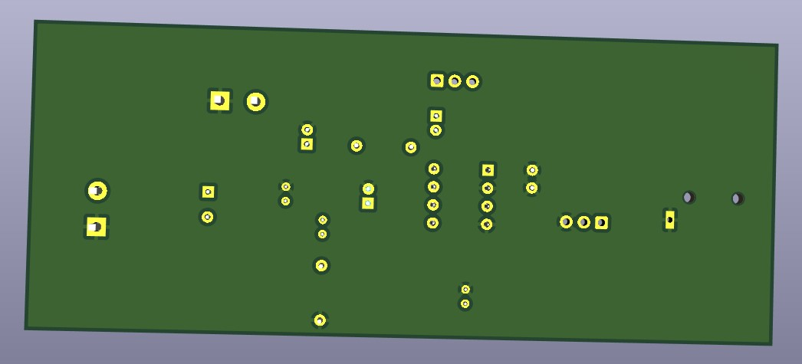
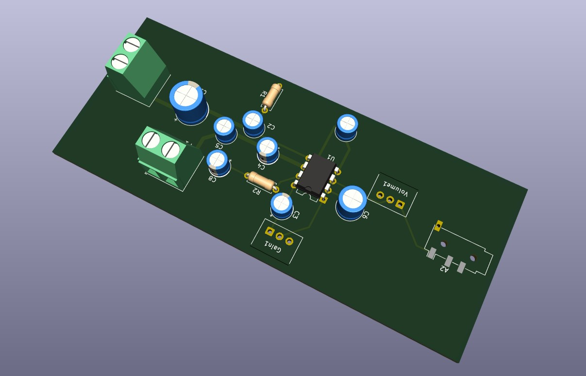
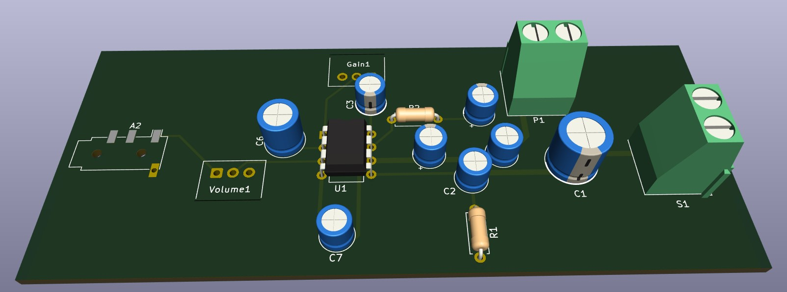
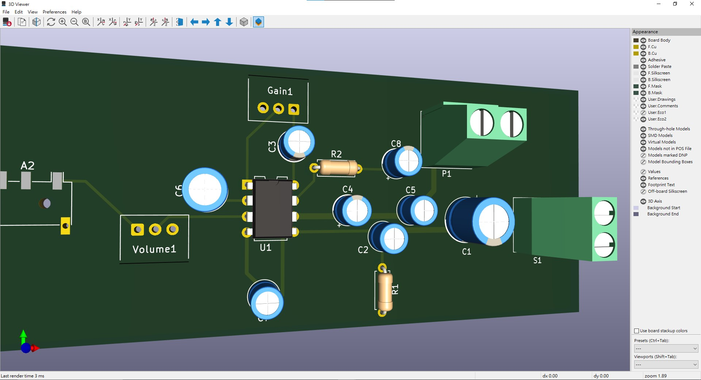

---

## 🧩 3D PCB View — LM386 High-Fidelity Amplifier

This section shows the **3D visualization** of the LM386 amplifier PCB, created in **KiCad 8.0**.
The board features a **two-layer layout** with top and bottom copper planes and compact component placement.

---

### 🔹 Top View

---

### 🔹 Bottom View

---

### 🔹 Back View

---

### 🔹 Under View

---

### 🔹 Zoomed Component View

---
